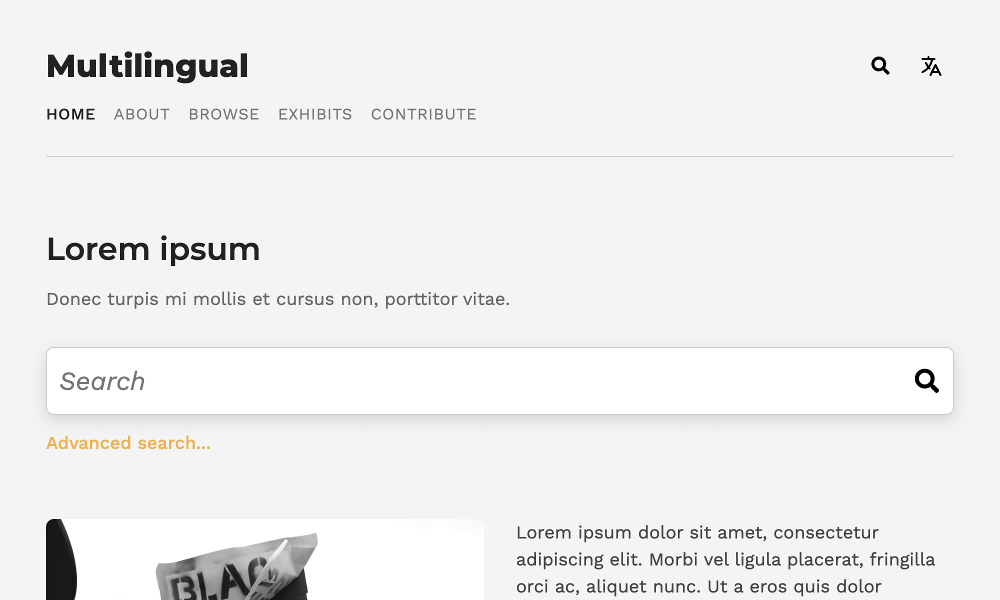

# Multilingual: Tema de Omeka S

*[Read in English](README.md)*

Este tema de Omeka S permite a sus usuarios cambiar la lengua del sitio.

## Vista previa

## Instalación

Use las versiones comprimidas que se proporcionan en GitHub para una instalación estándar.

## Dependencias

El módulo [nternationalization](https://github.com/Daniel-KM/Omeka-S-module-Internationalisation) debe ser instalado y configurado para permitir la funcionalidad completa. Se recomienda usar Omeka S versión 3.1.0 o posterior.

## Licencia

Este tema se basa en [The Daily](https://github.com/omeka-s-themes/thedaily), heredando su [licencia GPLv3](LICENSE).